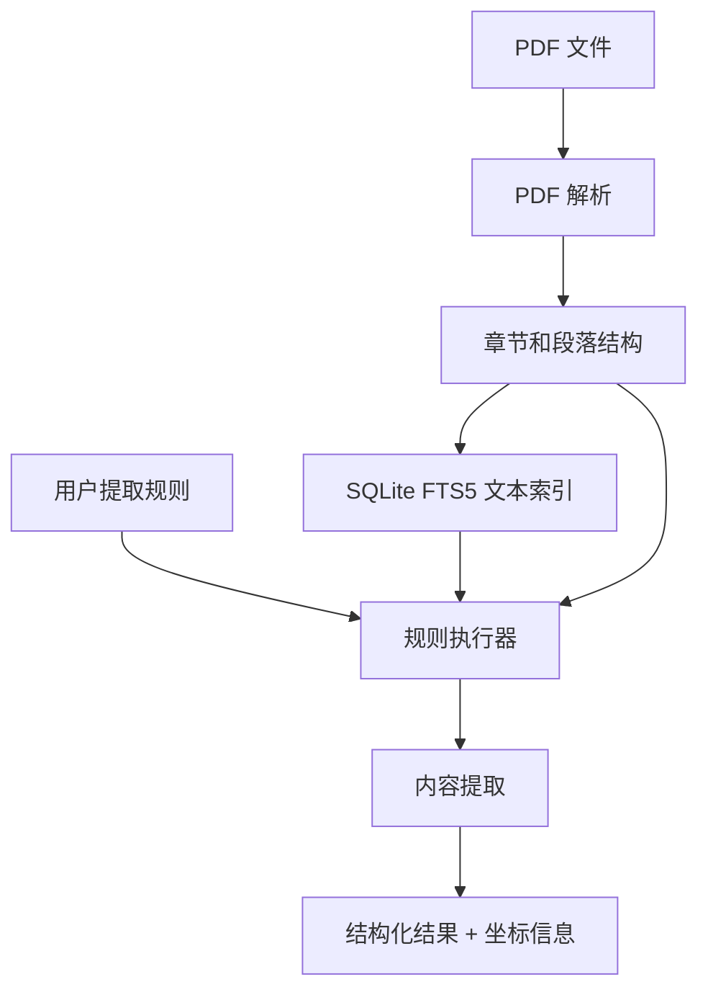

# PDF 结构化内容提取工具

## 1. 项目目标

本项目使用 Python 实现一个 PDF 内容提取工具，用于从可提取文本的 PDF 中定位并提取结构化数据。

该工具主要解决数据平台无法直接从 PDF 等非结构化文档中提取结构化数据的问题。

核心能力包括：

1. PDF 章节划分
2. 基于文本的区域定位
3. 基于规则的内容提取
4. 输出提取结果及其来源坐标信息

本项目暂不考虑 OCR，不处理纯扫描件 PDF 或图片型 PDF。

---

## 2. 设计原则

### 2.1 不使用复杂 Agent 架构

本项目不需要设计成真正的多 Agent 系统。

这里的 `AGENTS.md` 只是给 Codex 的开发指导文档，用于说明：

- 项目目标
- 模块职责
- 输入输出
- 实现约束
- 推荐目录结构
- 测试要求

代码实现上应采用普通的 Python 模块化设计，而不是自主 Agent、任务规划器或复杂工作流框架。

### 2.2 优先使用确定性方法

能用传统程序方法解决的部分，不要优先交给 LLM。

推荐优先级：

1. PyMuPDF / pdfplumber 提取文本、段落、坐标
2. SQLite FTS5 定位文本区域
3. 表格解析工具提取表格
4. LLM 只用于传统方法难以稳定处理的内容理解和字段抽取

### 2.3 保持系统简单

第一版只实现必要能力：

- PDF 文本提取
- TOC 章节划分
- 无 TOC 时的基础章节识别
- 段落级索引
- 关键词定位
- 简单规则驱动提取
- 提取结果带页码和 bbox 坐标

不要引入：

- 分布式任务系统
- 复杂 Agent 框架
- OCR
- 向量数据库
- 多租户权限系统
- Web UI
- 复杂 DSL

---

## 3. 核心流程



---

## 4. 推荐目录结构
```
pdf_extractor/
  __init__.py

  parser/
    __init__.py
    pdf_parser.py
    section_detector.py
    paragraph_builder.py

  indexer/
    __init__.py
    fts_indexer.py

  rules/
    __init__.py
    rule_schema.py
    rule_loader.py
    rule_executor.py

  extractor/
    __init__.py
    text_extractor.py
    table_extractor.py
    llm_extractor.py

  models/
    __init__.py
    document.py
    result.py

  utils/
    __init__.py
    bbox.py
    logging.py
    llm_connection.py

tests/

examples/
  example_rule.json
  run_extract.py
```

## 5. 数据模型

### 5.1 Document

表示一个 PDF 文档的解析结果。

```python
@dataclass
class Document:
    file_path: str
    pages: list[Page]
    sections: list[Section]
```

### 5.2 Page

```python
@dataclass
class Page:
    page_number: int
    width: float
    height: float
    paragraphs: list[Paragraph]
```

### 5.3 Section

```python
@dataclass
class Section:
    id: str
    title: str
    level: int
    start_page: int
    end_page: int | None
    paragraphs: list[str]
```

说明：

- `id` 用于唯一标识章节。
- `title` 是章节标题。
- `level` 表示章节层级，例如 1 表示章，2 表示节。
- `paragraphs` 存储该章节下的 paragraph id。

### 5.4 Paragraph

```python
@dataclass
class Paragraph:
    id: str
    text: str
    page_number: int
    bbox: BBox
    section_id: str | None
```

### 5.5 BBox

```python
@dataclass
class BBox:
    x0: float
    y0: float
    x1: float
    y1: float
```

### 5.6 ExtractionRule

```python
@dataclass
class ExtractionRule:
    id: str
    name: str
    scope: str | None
    keywords: list[str]
    extract_type: str
    target: str
    priority: int = 0
```

字段说明：

- `scope`: 提取范围，例如 `"第一章 第三节"`，也可以为空。
- `keywords`: 用于定位文本区域的关键词。
- `extract_type`: 可选值包括 `"text"`, `"value"`, `"table"`。
- `target`: 用户想提取的内容，例如 `"净收入金额"`、`"利润表格"`。

### 5.7 ExtractionResult

```python
@dataclass
class ExtractionResult:
    rule_id: str
    value: Any
    source_text: str | None
    page_number: int
    bbox: BBox
    confidence: float | None = None
```

------

## 6. 模块职责

## 6.1 PDF Parser

文件：

```
pdf_extractor/parser/pdf_parser.py
```

职责：

- 使用 PyMuPDF 读取 PDF。
- 提取每页文本块。
- 保留文本块的坐标信息。
- 生成 Page、Paragraph、Section 等结构。

第一版只处理可直接提取文本的 PDF。

不需要处理：

- OCR
- 扫描件 PDF
- 手写文本
- 图片中的文字

需要实现的接口：

```python
class PDFParser:
    def parse(self, file_path: str) -> Document:
        ...
```

------

## 6.2 Section Detector

文件：

```
pdf_extractor/parser/section_detector.py
```

职责：

1. 优先使用 PDF 自带 TOC 划分章节。
2. 如果没有 TOC，则使用简单规则识别章节标题。

### 有 TOC 的情况

使用 PyMuPDF：

```
doc.get_toc()
```

TOC 结果通常包含：

```JSON
[
    [level, title, page_number],
    ...
]
```

应根据 TOC 构建 Section。

### 无 TOC 的情况

使用简单启发式规则即可：

- 字体明显更大
- 文本较短
- 出现在页面顶部附近
- 匹配常见章节模式

例如：

```
1. Introduction
1.1 Revenue
第一章 总览
第三节 财务表现
Chapter 1
Section 2
```

不要做复杂机器学习模型。

需要实现的接口：

```python
class SectionDetector:
    def detect(self, pdf_doc, pages: list[Page]) -> list[Section]:
        ...
```

------

## 6.3 Paragraph Builder

文件：

```
pdf_extractor/parser/paragraph_builder.py
```

职责：

- 将 PyMuPDF 提取出的 text block 转换成段落。
- 每个段落必须保留：
  - 文本
  - 页码
  - bbox
  - 所属 section_id

第一版可以简单地将 PDF text block 视为 paragraph。

后续再考虑更复杂的段落合并逻辑。

------

## 6.4 FTS Indexer

文件：

```
pdf_extractor/indexer/fts_indexer.py
```

职责：

- 使用 SQLite FTS5 建立段落级全文索引。
- 支持关键词检索。
- 支持按章节过滤。
- 返回匹配段落及其坐标信息。

建议索引字段：

```
paragraph_id
section_id
page_number
text
```

需要实现的接口：

```python
class FTSIndexer:
    def build(self, document: Document) -> None:
        ...

    def search(
        self,
        keywords: list[str],
        section_id: str | None = None,
        limit: int = 20
    ) -> list[Paragraph]:
        ...
```

注意：

- 不要索引整页文本。
- 第一版只做段落级索引。
- 关键词多个时，优先返回同时包含多个关键词的段落。
- 如果没有完全匹配，再返回部分匹配结果。

### 中文关键词检索策略

SQLite FTS5 默认 tokenizer 对中文分词支持有限。第一版不引入中文分词库，也不实现自定义 tokenizer，使用 FTS5 内置的 `trigram` tokenizer 做关键词子串定位。

建议创建索引：

```sql
CREATE VIRTUAL TABLE paragraphs_fts USING fts5(
    paragraph_id UNINDEXED,
    section_id UNINDEXED,
    page_number UNINDEXED,
    text,
    tokenize = 'trigram'
);
```

检索规则：

1. 长度大于等于 3 个 Unicode 字符的关键词，使用 FTS5 `MATCH` 查询。
2. 长度小于 3 个 Unicode 字符的关键词，使用 `LIKE '%关键词%'` 或 Python 子串匹配作为 fallback。原因是 `trigram` 无法匹配少于 3 个 Unicode 字符的子串。
3. 多个关键词查询时，先取同时包含全部关键词的段落；没有完全匹配时，再按命中关键词数量降序返回部分匹配结果。
4. 对 FTS5 返回的候选段落，使用 Python 的 `keyword in paragraph.text` 做一次二次校验，避免查询语法、标点或 tokenizer 行为导致误判。
5. 用户输入必须通过参数绑定传给 SQLite。不要直接将用户关键词拼接进 SQL。构造 `MATCH` 表达式时，也要转义或包装用户关键词，避免引号、连字符和布尔关键字改变查询语义。

第一版不引入 `jieba` 等中文分词依赖。当前目标是基于用户提供的明确关键词定位段落，不需要搜索引擎级别的语义召回。后续如果需要支持近义词、术语归一化或自然语言搜索，再评估中文分词或自定义 tokenizer。

------

## 6.5 Rule Schema

文件：

```
pdf_extractor/rules/rule_schema.py
```

职责：

- 定义用户规则的数据结构。
- 校验规则字段是否合法。

规则示例：

```JSON
{
  "rules": [
    {
      "id": "net_income_001",
      "name": "提取净收入金额",
      "scope": "第一章 第三节",
      "keywords": ["利润", "净收入"],
      "extract_type": "value",
      "target": "净收入金额",
      "priority": 1
    },
    {
      "id": "income_table_001",
      "name": "提取利润表格",
      "scope": "第一章 第三节",
      "keywords": ["利润", "净收入"],
      "extract_type": "table",
      "target": "利润表格",
      "priority": 2
    }
  ]
}
```

------

## 6.6 Rule Loader

文件：

```
pdf_extractor/rules/rule_loader.py
```

职责：

- 从 JSON 文件加载规则。
- 转换为 `ExtractionRule` 对象。
- 做基础校验。

需要实现的接口：

```python
class RuleLoader:
    def load(self, rule_path: str) -> list[ExtractionRule]:
        ...
```

------

## 6.7 Rule Executor

文件：

```
pdf_extractor/rules/rule_executor.py
```

职责：

- 根据用户规则执行提取流程。
- 先根据 scope 找章节。
- 再根据 keywords 定位段落。
- 根据 extract_type 调用对应 extractor。

执行逻辑：

```python
for rule in rules:
    1. resolve scope to section_id
    2. search paragraphs by keywords in section
    3. pass matched paragraphs to extractor
    4. collect ExtractionResult
```

需要实现的接口：

```python
class RuleExecutor:
    def execute(
        self,
        document: Document,
        rules: list[ExtractionRule]
    ) -> list[ExtractionResult]:
        ...
```

------

## 6.8 Text Extractor

文件：

```
pdf_extractor/extractor/text_extractor.py
```

职责：

- 从匹配段落中提取文本内容。
- 适用于 extract_type 为 `"text"` 的规则。

需要实现的接口：

```python
class TextExtractor:
    def extract(
        self,
        rule: ExtractionRule,
        paragraphs: list[Paragraph]
    ) -> list[ExtractionResult]:
        ...
```

------

## 6.9 Value Extractor

可以放在：

```
pdf_extractor/extractor/text_extractor.py
```

或单独创建：

```
pdf_extractor/extractor/value_extractor.py
```

职责：

- 从匹配段落中提取特定数值。
- 第一版优先使用正则表达式和简单上下文规则。
- LLM 只作为可选 fallback。

示例目标：

```
净收入金额
总资产
营业利润
负债总额
```

第一版可以支持：

- 金额
- 百分比
- 数字
- 带单位的数值

例如：

```
净收入为 12.5 亿元
营业利润达到 RMB 3,200 million
同比增长 8.6%
```

需要输出：

- 提取值
- 原始文本
- 页码
- bbox

------

## 6.10 Table Extractor

文件：

```
pdf_extractor/extractor/table_extractor.py
```

职责：

- 从定位区域附近提取表格。
- 第一版可使用 pdfplumber。
- 如果关键词命中某段文本，应尝试提取该页附近的表格。

推荐策略：

1. 根据关键词定位到 page_number。
2. 在该页提取所有表格。
3. 判断表格中是否包含关键词。
4. 返回匹配表格。

需要实现的接口：

```python
class TableExtractor:
    def extract(
        self,
        rule: ExtractionRule,
        document: Document,
        paragraphs: list[Paragraph]
    ) -> list[ExtractionResult]:
        ...
```

注意：

- 表格结果也需要带 page_number。
- 如果可以获取表格 bbox，则返回表格 bbox。
- 如果无法获取精确 bbox，则返回关键词段落 bbox，并在结果中标记 bbox 来源。

------

## 6.11 LLM Extractor

文件：

```
pdf_extractor/extractor/llm_extractor.py
```

职责：

- 作为可选模块。
- 用于传统方法无法稳定提取的内容。
- 第一版不要把 LLM 作为主流程依赖。

使用场景：

- 从自然语言段落中理解目标字段。
- 多个数值同时出现时判断哪个是目标值。
- 表格结构不规则时辅助识别字段。

需要注意：

- LLM 输入应尽量小，只传命中的段落或候选表格。
- LLM 输出必须解析成结构化 JSON。
- LLM 不负责生成坐标，坐标必须来自 PDF 解析阶段。

------

## 7. 坐标信息要求

每个提取结果必须包含来源信息。

最少包括：

```JSON
{
  "page_number": 3,
  "bbox": {
    "x0": 72.1,
    "y0": 120.4,
    "x1": 520.5,
    "y1": 158.9
  }
}
```

建议额外包含：

```JSON
{
  "source_text": "净收入为 12.5 亿元，同比增长 8.6%",
  "section_title": "第一章 第三节 财务表现",
  "paragraph_id": "p_000123"
}
```

坐标信息原则：

- 文本结果使用段落 bbox。
- 数值结果优先使用包含该数值的 span bbox。
- 如果无法获取 span bbox，则使用段落 bbox。
- 表格结果优先使用表格 bbox。
- 如果无法获取表格 bbox，则使用命中关键词段落 bbox。

------

## 8. 输出格式

建议输出 JSON。

示例：

```JSON
{
  "file_path": "example.pdf",
  "results": [
    {
      "rule_id": "net_income_001",
      "rule_name": "提取净收入金额",
      "extract_type": "value",
      "target": "净收入金额",
      "value": "12.5 亿元",
      "source_text": "公司本期净收入为 12.5 亿元，同比增长 8.6%。",
      "page_number": 8,
      "bbox": {
        "x0": 72.1,
        "y0": 120.4,
        "x1": 520.5,
        "y1": 158.9
      },
      "confidence": 0.86
    }
  ]
}
```

------

## 9. 第一版实现范围

第一版必须完成：

- 读取 PDF
- 提取文本 block
- 生成段落结构
- 获取 PDF TOC
- 有 TOC 时按 TOC 划分章节
- 无 TOC 时用简单规则识别章节
- 建立 SQLite FTS5 索引
- 根据关键词定位段落
- 根据规则提取文本
- 根据规则提取简单数值
- 根据规则提取表格
- 返回结果及坐标信息
- 提供 CLI 示例

第一版可以暂缓：

- OCR
- 图片内容识别
- 多模态 LLM
- 复杂跨页表格识别
- 高精度表格 bbox
- Web UI
- 向量检索
- 异步任务调度

------

## 10. CLI 示例

提供一个简单命令行入口：

```bash
python examples/run_extract.py \
  --pdf examples/sample.pdf \
  --rules examples/example_rule.json \
  --output examples/output.json
```

------

## 11. 示例代码入口

文件：

```
examples/run_extract.py
```

伪代码：

```python
from pdf_extractor.parser.pdf_parser import PDFParser
from pdf_extractor.indexer.fts_indexer import FTSIndexer
from pdf_extractor.rules.rule_loader import RuleLoader
from pdf_extractor.rules.rule_executor import RuleExecutor

pdf_path = "examples/sample.pdf"
rule_path = "examples/example_rule.json"

parser = PDFParser()
document = parser.parse(pdf_path)

indexer = FTSIndexer()
indexer.build(document)

rules = RuleLoader().load(rule_path)

executor = RuleExecutor(indexer=indexer)
results = executor.execute(document, rules)

print(results)
```

------

## 12. 测试要求

必须包含基础单元测试。

### 12.1 PDF Parser 测试

验证：

- 能读取 PDF
- 能提取页面数量
- 能提取段落文本
- 段落包含 page_number 和 bbox

### 12.2 Section Detector 测试

验证：

- 有 TOC 时能生成 Section
- 无 TOC 时能识别简单标题
- 段落能关联到 section_id

### 12.3 FTS Indexer 测试

验证：

- 能建立 FTS5 索引
- 能按关键词搜索
- 能按 section_id 过滤
- 搜索结果包含 paragraph id 和 bbox

### 12.4 Rule Executor 测试

验证：

- 能加载规则
- 能根据 scope 和 keywords 找到候选段落
- 能调用正确 extractor
- 能返回 ExtractionResult

### 12.5 Value Extractor 测试

验证：

- 能提取金额
- 能提取百分比
- 能提取带单位数字
- 提取结果包含来源文本和 bbox

------

## 13. 实现约束

- 推荐使用 PyMuPDF 作为 PDF 解析主库。
- 推荐使用 SQLite FTS5 做全文索引。
- 可以使用 LLM 的多模态能力 或 pdfplumber 辅助表格提取。
- 不要引入重量级框架。
- 不要实现 OCR。
- LLM 相关能力必须封装到utils/llm_connection中，直接用OpenAI SDK就好。
- 所有提取结果都必须保留来源坐标。
- 代码应保持模块清晰，便于后续扩展。

------

## 14. 不要做的事情

不要在第一版中实现以下内容：

- OCR
- 图片识别
- 自主 Agent 规划
- 复杂任务编排
- 向量数据库
- Web 服务
- UI
- 权限系统
- 多用户系统
- 云存储集成
- 复杂规则 DSL
